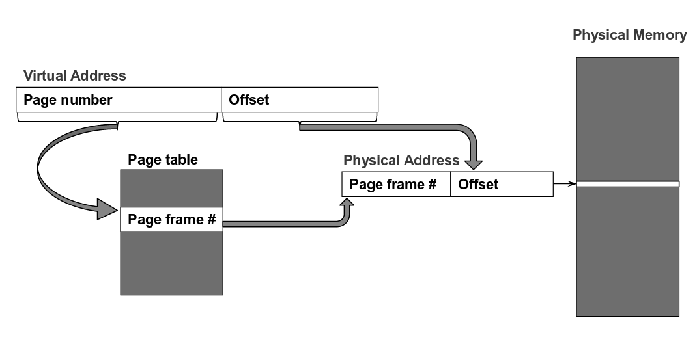
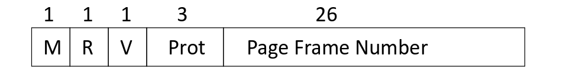

# CSC369 Review :weary: :weary: :weary:

## Table of Contents

- [Week 6: Memory Management](#week-6-memory-management)

## Week 6 Memory Management
\- <strong>GOALs of VM</strong>:
* `6.1 Efficiency`: since only have a limited amount of physical memory, must use efficiently. 
* `6.2 Transparency`: since must provide the illusion of “infinite” memory to each process. 
* `6.3 Protection and sharing`: since physical memory is accessed by multiple processes, and must ensure data privacy.
  

### 6.1 Efficiency  
*Efficiency explained*:  - Some portions are in DRAM.  - Some portions are stored on disk.  - Transfer data back and forth as needed.
  
### 6.2 Transparency  
*Transparency explained*:  - Give each process its own view of memory.  - Decouple the data layout from where the data is actually stored in physical memory.

**6.2.1 Fixed Partitioning** 

* Each process gets a fixed partition to use. (OS occupies a seperate partition)
* *Three* main problems introduced by `fixed partitioning`: 
\- If process is smaller than the partition, this will cause **internal fragmentation** (wastes memory)  
\- If program needs more memory than the partition size, programmer has to deal with that. (**overlays**) 
\- Number of partitions is **limited**.
    

### 6.2.2 Dynamic partitioning 
Partitions will vary in length and numbers over time. When a process is brought into memory, a partition of exactly the right size is created to hold it.
* If a process exited, a "hole" will be created, and some holes may be too small to be re-used. This will cause **external fragmentation**. 
* OS may move processes around to create large chunks of free space. This is called **compaction** and requires processes to be **relocatable**.

### 6.2.3 Solution - VM Paging 
Paging works by decoupling address space completely from actual physical data location and splitting both virtual and physical memory in same-size **pages**.
 

 
* Each process gets the illusion of its personal address space (<em>AS</em>) from
**0 to 2^64-1**.
* Each virtual page can be mapped to any physical page.
* Data is either in **memory** or on **disk** (must bring data in memory if needed).

### 6.2.4 Translation
* Each process needs to have its address space pages translated to real physcial address.
* Hardware (MMU) converts VAs into PAs using the **Page Table**.
* Each process running in the OS has its own page table.

### 6.2.5 Page Faults
* If the page table entry indicates that the page is not in memory, then this causes a **page fault**.
* Os is responsible for loading page from the disk and the process will stop until the data is brought into memory.
* Page replacement policy is up to the OS.

Notice that it will not be way too slow due to the localized patterns:
- **Temporal locality:** Locations referenced recently likely to be referenced again.
- **Spacial locality:** Locations near recently referenced locations are likely to be referenced soon.
- Although cost of paging is high, if it's infrequent enough (due to locality), it's acceptable.
  

### 6.3 Protection and sharing
- Processes should not access other processes' memory. (Must protect process address spaces, implies we need rights for pages like file permissions)
- Priviledged OS data shouldn't be accessible to users.

### 6.3.1 VM enforces protection
- Access rights are kept in the page tables. Hardware enforces protection, OS is called when violation happens. Page tables cannot be modified by users since they exist in protected OS memory (only OS can modify them).
- Avoid leaked information from deallocated pages. Programmer should not have to zero out each page on dealloc. OS uses a "zero-ed" page and give the VA of that page to ensure that newly allocated pages are zero-ed out.

### 6.4 Address binding
- Option 1: Compile time 
&nbsp;&nbsp;- Must know what memory the process will use, during compilation. 
&nbsp;&nbsp;- Called <em>absolute code</em> since binary contains real addresses. 
&nbsp;&nbsp;- No relocation is possible.
- Option 2: Load time (static relocation) 
&nbsp;&nbsp;- Compiler: translates(binds) symbolic addresses to <en>logical,</em> <em>relocatable</em> addresses within the source file. 
&nbsp;&nbsp;- Linker: translates addresses from obj files to <em>logical,</em> <em>absolute</em> addresses within executable. Also takes care of &nbsp;&nbsp;references to symbols from other files. 
&nbsp;&nbsp;- Loader translates logical absolute address to <em>physical</em> addresses when program is loaded into memory. 

### 6.5 A better plan: Dynamic Relocation 
Process refers to **relative** addresses, hardware translates to physical address as instruction is executed.
* Two registers called **base** and **bound** on the MMU, these two registers get saved in the PCB when we do a context switch since MMU only has one base and bound register.
* The executable simply stores virtual addresses (starting at 0), and instructions in the executable do not need to be modified.
* When a program starts to run: - Set the base register. - Physical address can be translated as the following: *physcial address = base + virtual address*
* The bound register ensures that we don't access outside a process' address space.

### 6.5.1 Placement algorithms 
Need *dynamic relocation*.
* Best-fit: choose the block that is closest in size to the request 
&nbsp;&nbsp;- left-over fragments tend to be small(unusable)
&nbsp;&nbsp;- in practise, similar storage utilization to first-fit
* First-fit: choose the first block that is large enough, search can start at beginning, or where previous search ended 
&nbsp;&nbsp;- simplest, and often fastest and most efficient 
&nbsp;&nbsp;- may leave many small fragments near start of memory that must be searched repeatedly 
&nbsp;&nbsp;- next-fit variant tends to allocate from end of memory (free space becomes fragmented more rapidly) 
* Worst-fit: choose the largest block 
&nbsp;&nbsp;- not as good as best-fit or first-fit in practice 
* quick-fit: keep multiple free lists for common block sizes 
&nbsp;&nbsp;- great for fast allocation, generally harder to coalesce 

### 6.6 Paging 
* **Page frames** - logically partition physical memory into equal, fixed-size chunks
* **Virtual pages** - divide processes' memory into chunks of the same size
* Any page can be assigned to any free page frame.
* Possible page frame sizes are restricted to powers of 2 to simplify address translation.
* Virtual addresses now interpreted as *page number + page offset*: 
&nbsp;&nbsp; - page number = vaddr / page_size 
&nbsp;&nbsp; - page offset = vaddr % page_size 

 Details:
* MMU hardware generates address of page table entry, does lookup without OS. 
* OS has to load PTBR (*page table base register*) for new process on context switch since page tables are per process.

### 6.6.1 The Page Table
Stroed in protected memory, and a user process cannot access its own page table.
* A linear array of *page table* entries, 1 entry per virtual page.
* Stored in **OS memory, attached to process structure**.
* Virtual page number (VPN) serves as array index.
* Allocate enough physical memory (ppages) for entire page table.

### 6.6.2 Page Table Entries
 
* **Modify bit**(M) says whether or not page has been written. Set when a write to a page occurs.
* **Reference bit**(R) says whether page has been accessed. Set when a read or write to the page occurs.
* **Valid bit**(V) says whether PTE can be used. Checked on each use of virtual address.
* **Protection bit**(Prot) specifies what operations are allowed on page (read/write/execute)
* **Page frame number**(PFN) determines physcial page. Not all bits are provided by all architectures.