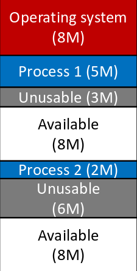
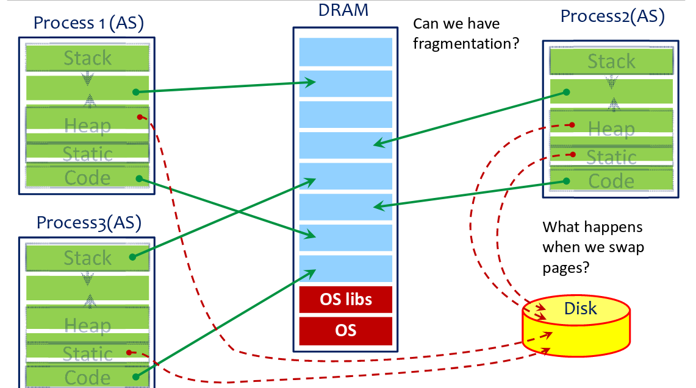

# CSC369 Review :weary: :weary: :weary:

## Table of Contents

- [Week 6: MEMORY MANAGEMENT](#Week 6: MEMORY MANAGEMENT)

## Week 6: MEMORY MANAGEMENT
\- <strong>GOALs of VM</strong>:
* `6.1 Efficiency`: since only have a limited amount of physical memory, must use efficiently. 
* `6.2 Transparency`: since must provide the illusion of “infinite” memory to each process. 
* `6.3 Protection and sharing`: since physical memory is accessed by multiple processes, and must ensure data privacy.

**6.1: Efficiency**  
*Efficiency explained*:  - Some portions are in DRAM.  - Some portions are stored on disk.  - Transfer data back and forth as needed.

**6.2: Transparency**  
*Transparency explained*:  - Give each process its own view of memory.  - Decouple the data layout from where the data is actually stored in physical memory.

**6.2.1: Fixed Partitioning:** 

* Each process gets a fixed partition to use. (OS occupies a seperate partition)
* *Three* main problems introduced by `fixed partitioning`: 
\- If process is smaller than the partition, this will cause **internal fragmentation** (wastes memory)  
\- If program needs more memory than the partition size, programmer has to deal with that. (**overlays**) 
\- Number of partitions is **limited**.
    

**6.2.2: Dynamic partitioning** 
Partitions will vary in length and numbers over time. When a process is brought into memory, a partition of exactly the right size is created to hold it.
* If a process exited, a "hole" will be created, and some holes may be too small to be re-used. This will cause **external fragmentation**. 
* OS may move processes around to create large chunks of free space. This is called **compaction** and requires processes to be **relocatable**.

**6.2.3: Solution - VM Paging** 
Paging works by decoupling address space completely from actual physical data location and splitting both virtual and physical memory in same-size **pages**.
 

 
* Each process gets the illusion of its personal address space (<em>AS</em>) from
**0 to 2^64-1**.
* Each virtual page can be mapped to any physical page.
* Data is either in **memory** or on **disk**.