# CSC369 Review :weary: :weary: :weary:

## Table of Contents

- [Week 6: Memory Management](#week-6-memory-management)
- [Week 7 + 9 1/2: Paged Virtual Memory](#week-7-paged-virtual-memory)
- [Week 10 + 9 1/2: Disk and File System](#week-10-file-systems)
- [Week 11: File Systems Integrity](#week-11-file-systems-integrity)
- [Week 12: Deadlock](#week-12-deadlock)

## Week 6 Memory Management
\- <strong>GOALs of VM</strong>:
* `6.1 Efficiency`: only have a limited amount of physical memory, must use efficiently. 
* `6.2 Transparency`: must provide the illusion of “infinite” memory to each process. 
* `6.3 Protection and sharing`: since physical memory is accessed by multiple processes, and must ensure data privacy.
  

### 6.1 Efficiency  
*Efficiency explained*:  - Some portions are in DRAM.  - Some portions are stored on disk.  - Transfer data back and forth as needed.
  
### 6.2 Transparency  
*Transparency explained*:  - Give each process its own view of memory.  - Decouple the data layout from where the data is actually stored in physical memory.

**6.2.1 Fixed Partitioning** 

* Each process gets a fixed partition to use. (OS occupies a seperate partition)
* *Three* main problems introduced by `fixed partitioning`: 
\- If process is smaller than the partition, this will cause **internal fragmentation** (wastes memory)  
\- If program needs more memory than the partition size, programmer has to deal with that. (**overlays**) 
\- Number of partitions is **limited**.
    

### 6.2.2 Dynamic partitioning 
Partitions will vary in length and numbers over time. When a process is brought into memory, a partition of exactly the right size is created to hold it.
* If a process exited, a "hole" will be created, and some holes may be too small to be re-used. This will cause **external fragmentation**. 
* OS may move processes around to create large chunks of free space. This is called **compaction** and requires processes to be **relocatable**.

### 6.2.3 Solution - VM Paging 
Paging works by decoupling address space completely from actual physical data location and splitting both virtual and physical memory in same-size **pages**.
 

 
* Each process gets the illusion of its personal address space (<em>AS</em>) from
**0 to 2^64-1**.
* Each virtual page can be mapped to any physical page.
* Data is either in **memory** or on **disk** (must bring data in memory if needed).

### 6.2.4 Translation
* Each process needs to have its address space pages translated to real physcial address.
* Hardware (MMU) converts VAs into PAs using the **Page Table**.
* Each process running in the OS has its own page table.

### 6.2.5 Page Faults
* If the page table entry indicates that the page is not in memory, then this causes a **page fault**.
* Os is responsible for loading page from the disk and the process will stop until the data is brought into memory.
* Page replacement policy is up to the OS.

Notice that it will not be way too slow due to the localized patterns:
- **Temporal locality:** Locations referenced recently likely to be referenced again.
- **Spacial locality:** Locations near recently referenced locations are likely to be referenced soon.
- Although cost of paging is high, if it's infrequent enough (due to locality), it's acceptable.
  

### 6.3 Protection and sharing
- Processes should not access other processes' memory. (Must protect process address spaces, implies we need rights for pages like file permissions)
- Priviledged OS data shouldn't be accessible to users.

### 6.3.1 VM enforces protection
- Access rights are kept in the page tables. Hardware enforces protection, OS is called when violation happens. Page tables cannot be modified by users since they exist in protected OS memory (only OS can modify them).
- Avoid leaked information from deallocated pages. Programmer should not have to zero out each page on dealloc. OS uses a "zero-ed" page and give the VA of that page to ensure that newly allocated pages are zero-ed out.

### 6.4 Address binding
- Option 1: Compile time 
&nbsp;&nbsp;- Must know what memory the process will use, during compilation. 
&nbsp;&nbsp;- Called <em>absolute code</em> since binary contains real addresses. 
&nbsp;&nbsp;- No relocation is possible.
- Option 2: Load time (static relocation) 
&nbsp;&nbsp;- Compiler: translates(binds) symbolic addresses to <en>logical,</em> <em>relocatable</em> addresses within the source file. 
&nbsp;&nbsp;- Linker: translates addresses from obj files to <em>logical,</em> <em>absolute</em> addresses within executable. Also takes care of &nbsp;&nbsp;references to symbols from other files. 
&nbsp;&nbsp;- Loader translates logical absolute address to <em>physical</em> addresses when program is loaded into memory. 

### 6.5 A better plan: Dynamic Relocation 
Process refers to **relative** addresses, hardware translates to physical address as instruction is executed.
* Two registers called **base** and **bound** on the MMU, these two registers get saved in the PCB when we do a context switch since MMU only has one base and bound register.
* The executable simply stores virtual addresses (starting at 0), and instructions in the executable do not need to be modified.
* When a program starts to run: - Set the base register. - Physical address can be translated as the following: *physcial address = base + virtual address*
* The bound register ensures that we don't access outside a process' address space.

### 6.5.1 Placement algorithms 
Need *dynamic relocation*.
* Best-fit: choose the block that is closest in size to the request 
&nbsp;&nbsp;- left-over fragments tend to be small(unusable)
&nbsp;&nbsp;- in practise, similar storage utilization to first-fit
* First-fit: choose the first block that is large enough, search can start at beginning, or where previous search ended 
&nbsp;&nbsp;- simplest, and often fastest and most efficient 
&nbsp;&nbsp;- may leave many small fragments near start of memory that must be searched repeatedly 
&nbsp;&nbsp;- next-fit variant tends to allocate from end of memory (free space becomes fragmented more rapidly) 
* Worst-fit: choose the largest block 
&nbsp;&nbsp;- not as good as best-fit or first-fit in practice 
* quick-fit: keep multiple free lists for common block sizes 
&nbsp;&nbsp;- great for fast allocation, generally harder to coalesce 

### 6.6 Paging 
* **Page frames** - logically partition physical memory into equal, fixed-size chunks
* **Virtual pages** - divide processes' memory into chunks of the same size
* Any page can be assigned to any free page frame.
* Possible page frame sizes are restricted to powers of 2 to simplify address translation.
* Virtual addresses now interpreted as *page number + page offset*: 
&nbsp;&nbsp; - page number = vaddr / page_size 
&nbsp;&nbsp; - page offset = vaddr % page_size 

 Details:
* MMU hardware generates address of page table entry, does lookup without OS. 
* OS has to load PTBR (*page table base register*) for new process on context switch since page tables are per process.

### 6.6.1 The Page Table
Stored in protected memory, and a user process cannot access its own page table.
* A linear array of *page table* entries, 1 entry per virtual page.
* Stored in **OS memory, attached to process structure**.
* Virtual page number (VPN) serves as array index.
* Allocate enough physical memory (ppages) for entire page table.

### 6.6.2 Page Table Entries
 
* **Modify bit**(M) says whether or not page has been written. Set when a write to a page occurs.
* **Reference bit**(R) says whether page has been accessed. Set when a read or write to the page occurs.
* **Valid bit**(V) says whether PTE can be used. Checked on each use of virtual address.
* **Protection bit**(Prot) specifies what operations are allowed on page (read/write/execute)
* **Page frame number**(PFN) determines physcial page. Not all bits are provided by all architectures.

## Week 7: Paged Virtual Memory
**Multi-level page tables** split page table into *pages of PTEs*, use a *page table directory* to point to different pages of PTEs. 
Following is the comparison between linear page table and multi-level page table. 
 

### 7.1 Two-level Page Tables 
 
**Tradeoff: space vs. time**
* Saves space
* Adds more levels of indirection when translating addresses which means more complexity in the translation algorithm.

### 7.2 Hashed Page Tables 

### 7.3 Paging Limitations - Time
* 2 memory reads(references) per address loopup. (First read page table, then actual memory)
* Hierarchical page tables make it worse due to one read per level of page table. (Solution: use a hardware cache of lookups)

### 7.4 Translation Lookaside Buffer (TLB)
Small, fully-associative hardware cache of recently used translations. It translates virtual page numbers (VPNs) into PTEs (not physical addresses) and can be done in a single machine cycle. 
TLBs are implemented in hardware:
* Fully associative cache (all entries looked up in parallel).
* Cache tags are virtual page numbers.
* Cache values are PTEs (entries from page tables).
* With PTE + offset, can directly calculate physical address. 
 

\- TLB exploit **locality**
* Processes only use a handful of pages at a time, and we only need those pages to be "mapped".
* Hit rates: >99% of translations are hits.

\- Managing TLBs
* OS ensures that *TLB and page tables are consistent*. e.g. when it changes the protection bits of a PTE, it needs to update the copy of the PTE in the TLB(if one exists). Typically, just invalidate the entry.
* Reload TLB on a *process context switch*. Invalidate all entries.
* When the TLB misses and a new PTE has to be loaded, *a cached PTE must be evicted*. Choosing PTE to evict is called the *TLB replacement policy* and is implemented in hardware.

### 7.5 Demand paging
Pages can be moved between memory and disk, this is called *demand paging*.
1. Initially, pages are allocated to memory.
2. When memory fills up, allocating a page in memory requires some other page to be evicted from memory. 
&nbsp;&nbsp; - When a process accesses the page, the invalid PTE will cause a trap(*page fault*). 
&nbsp;&nbsp; - The trap will run the OS page fault handler. 
&nbsp;&nbsp; - Handler uses the invalid PTE to locate page in swap file. 
&nbsp;&nbsp; - Reads page into a physical frame, update PTE to point to it. 
3. Evicted pages go to disk (swap file). 
&nbsp;&nbsp; - When it evicts a page, the OS sets the PTE as invalid and stores the location of the page in swap file in PTE. 
* The movement of pages between memory and disk is done by the OS, and is transparent to the application.
* Actually, only **dirty** pages need to be written to disk. Clean pages do not, but you need to know where on disk to read them from again.
* Demand paging is also used when a process first starts up. When a process is created, it has a brand new page table with all valid bits off and no pages in memory. When the process starts executing, instructions fault on code and data pages, faulting stops when all necessary code and data pages are in memory. Only code and data needed by a process needs to be loaded.
* Alternative of *prepaging* which predicts future page that will be used. 

### 7.6 Placement Policy
In paging systems, memory management hardware can translate any virtual-to-physical mapping equally well.
* Non-uniform Memory Access Multiprocessors. Any processor can access entire memory, but local memory is faster.
* Cache performance. Choose physical pages to minimize cache conflicts.

### 7.7 Replacement Policy
The page replacement algorithm determines how a victim is chosen.

### 7.7.1 Belady's algorithm (OPT)
It has the lowest fault rate for any page reference string. It works by replacing the page that will not be used for the longest period of time.

### 7.7.2 First-In-First-Out (FIFO)
* Maintain a list of pages in order in which they were paged in. On replacement, simply evict the one brought in longest time ago.
* The fault rate **increases** when the algorithm is given more memory.

### 7.7.3 Least Recently Used (LRU)
* Uses reference information to make a more informed replacement decision. Can make a guess of the future based opon past experience.
* On replacement, evict the page that has not been used for the longest time in the past.
* Options for implementing LRU:
&nbsp;&nbsp; \- *Time stamp* every reference and evict the page with oldest time stamp. The problem is we need to make PTE large enough to hold meaningful time stamp and need to examing every page on eviction to find one with oldest time stamp. 
&nbsp;&nbsp; \- Keep pages in a *stack*. On reference, move the page to the top of the stack. On eviction, replace page at bottom. The problem is we need costly software operation to manipulate stack on *EVERY* memory reference.
* We can implement *Approximating LRU* to avoid too much cost. It uses the PTE *reference bit*. Keep a counter for each page. At regular intervals, for every page: shift R bits into high bit of counter register, shift other bits to the right and pages with "larger" counters were used more recently.

### 7.7.4 Clock
Replace page that is "*old enough*".
* Arrange all of physical page frames in a big circle (clock).
* A clock hand is used to select a good LRU candidate. 
&nbsp;&nbsp; \- Sweep through the pages in circular order like a clock. 
&nbsp;&nbsp; \- If the ref bit is off, it hasn't been used recently. 
&nbsp;&nbsp; \- If the ref bit is on, turn it off and go to next page.
* Arm moves quickly when pages are needed and low overhead when plenty of memory.
* If memory is large, "accuracy" of information degrades.

### 7.8 Thrashing
Thrashing takes place when more time is spent by the OS in paging data back and forth from disk than executing user programs caused by memory demands of the set of running processes simply exceeding the available physcial memory.
* `Admission control`: Given a set of processes, a system could decide not to run a subset of processes, with the hope that the reduced set of processes' *working sets* (the pages that they are using actively) fit in memory and thus can make progress. (states that it is sometimes better to do less work well than to do everything at once poorly)
* `Out-of-memory killer`: this daemon chooses a memory-intensive process and kills it, thus reducing memory in a none-too-subtle manner. While successful at reducing memory pressure, this approach can have problems, if, for example, it kills the X server and thus renders any applications requiring the display unusable.

### 7.9 CPU utilization

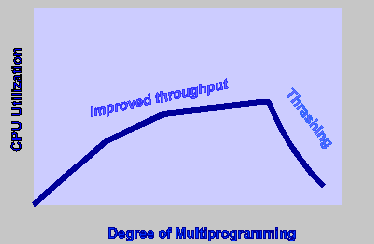

As the illustration shows, *CPU utilization* of a system can be improved by using multiprogramming. Let P be the fraction of time that a process spends away from the CPU. If there is one process in memory, the CPU utilization is 1-P. If there are N processes in memory, the probability of N processes waiting for an I/O is P\*P...*p (N times). The CPU utilization is (1-P^N) where N is the degree of multiprogramming. As N increases, the CPU utilization increases. 
However, once the system passes the point of optimal CPU utilization, as less memory is available to each program will cause higher page fault likelihood i.e. it thrashes.

### 7.10 Page Buffering
Previously, we assumed the replacement algorithm is run and a victim selected when a new page needs to be brought in. Most of these algorithms are too costly to run on every page fault. 
In actuality, OS keeps a small portion of memory free by having some kind of *high watermark* and *low watermark* to help decide when to start evicting pages from memory. When the OS notices that there are fewer than *LW* pages available, a background thread (`swap daemon`) is responsible for freeing memory runs. It evicts pages until there are *HW* pages available, then goes to sleep.

### 7.11 Swap Space
The space on disk for moving pages back from memory and forth to memory.  
Swap space is not the only on-disk location for swapping. Assume you are running a program binary. The code pages from this binary are initially found on disk, and when the program runs, they are loaded into memory (one page at a time when needed). However, if the system needs to make room in physical memory for other needs, it can safely re-use the memory space for these code pages, knowing that it can later swap them in again from the on-disk binary in the file system.

### 7.12 TLB misses
When a process is executing on the CPU, and it issues a read to an address. The read address goes to the TLB in the MMU. 
*Notice that this is all done by the hardware.*
1. TLB does a lookup using the page number of the address.
2. Common case is that the page number matches, returning a PTE for the mapping for this address.
3. TLB validates that the PTE protection allows reads.
4. PTE specifies which physical frame holds the page.
5. MMU combines physical frame & offset into a physical address.
6. MMU reads from that physical address, returns value to CPU. 

---
If TLB does not have a PTE mapping for this virtual address, known as a *minor page fault* as no I/O will be needed in the following solutions. There are two possibilities:
1. MMU loads PTE from page table in memory. Hardware managed TLB, OS not involved in this step, and OS has already set up the page tables so that the hardware can access it directly.
2. Trap to OS. In this case, software manages TLB. OS does lookup in page table, loads PTE into TLB and returns from exception, then retries memory access.

---
If access is not permitted by PTE. PTE will indicate a protection fault, either operation is not permitted on page (r/w/x) or virtual page not allocated/not in physical memory. 
TLB traps to the OS:
* Permission denied: OS may send fault back up to process, or might be using protection for other purposes (e.g. cow, mapped files).
* Invalid: If virtual page not allocated in address space, OS sends fault to process (e.g. segmentation fault). If page not in physical memory (major page fault), OS allocates frame and reads it in.

### 7.13 Working Set Model
A *working set* of a process is used to model the dynamic locality of its memory usage.
* W(t, r) = {pages P s.t. P was referenced ini the time interval (t, t-r)}
* w(t, r) = number of pages in W(t, r) 

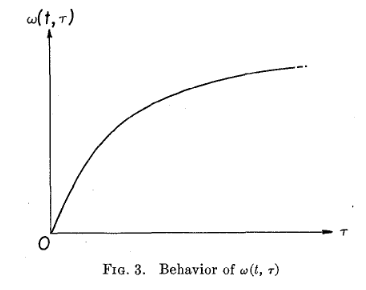

The working set size <strong>changes with program locality</strong>. During periods of poor locality, more pages are referenced, and within this period of time, the working set size is larger. So, intuitively, want the working set to be the set of pages a process needs in <em>memory</em> to prevent heavy faulting. 
e.g. when people ask, "How much memory does Firefox need?", they are in effect asking for the size of Firefox's working set.

### 7.14 Shared memory
Since private virtual address spaces protect applications from each other, but this makes it difficult to share data. Parents and children in a forking web server or proxy will want to share an in-memory cache without copying. So, we can use shared memory to allow processes to share data using direct memory references.
  
Implement sharing using page tables:
* Have PTEs in both tables map to the same physical frame.
* Each PTE can have different protection values.
* Must update both PTEs when page becomes invalid.
In the illustration above, we map shareed memory at same virtual addresses. We can also map at different virtual addresses in each process' address space. It will be more flexible since we can avoid address space conflicts, but pointers inside the shared memory segment are invalid.

### 7.15 Copy On Write
Copy on write (*CoW*) is used to defer large copies as long as possible, hoping to avoid them altogether. 
* Instead of copying pages, create *shared mappings* of parent pages in child virtual address space.
* Shared pages are protected as read-only in child. Reads happen as usual. Writes generate a protection fault, trap to OS, copy page, change page mapping in client page table, restart write instruction.

### 7.16 Memory Mapped Files
Bind a file to a virtual memory region:
* PTEs map virtual addresses to physical frames holding file data.
* Virtual address base + N corresponds to offset N in file.
* Can read or write at various offsets in file, using memory operations.

---
Initially, all pages mapped to file are invalid:
* OS reads a page from file when invalid page is accessed.
* OS write a page to file when evicted, or region unmapped.

---
Advantages:
- Uniform access for files and memory (just use pointers)
- Less copying.
 
Drawbacks:
- Since OS handles faults transparently, process has less control over data movement.
- Does not generalize to streamed I/O. (pipes, sockets, etc. only works for files)

## Week 10 File Systems
File system should provide long-term information storage. It is required to store very large amounts of information which must survive the termination of process using it, and multiple processes must be able to access info concurrently. 
Two views of file systems:
- User view \- convenient logical origanization of information.
- OS view \- managing physical storage media, enforcing access restrictions.

### 10.1.1 File Table (handling operations on files)
When file is first used actively, store its attribute info in a system-wide open-file table. The index (*fd*) into this table is used on subsequent operations, hence no searching is required. 
 

### 10.1.2 File Sharing
Have 2 levels of internal tables:
- A per-process table of all files that each process has open (also holds the current file positions)
- Each entry in the per-process table points to an entry in the system-wide open-file table. 

### 10.1.3 File Access Methods
Modern systems typically only support simple access:
- Sequential access \- read bytes one at a time, in order
- Direct access \- random access given block/byte number

### 10.1.4 File links
* Hard link \- second directory indentical to the first one
* Symbolic link \- Directory entry refers to file that holds "true" path to the linked file.

### 10.2.1 Directories
Directories serves multiple purposes:
* For users, they provide a structured way to organize files.
* For the file system, they provide a convenient naming interface that allows the implementation to separate logical file organization from physical file placement on the disk.
* Stores information about files

### 10.2.2 Directory Structure
* A directory is a list of entries \- names and associated metadata (information that describes properties of the data e.g. size, protection, location, etc.)
* List is usually unordered.
* Directories typically stored in files. Only need to manage one kind of secondary unit. 

### 10.2.3 Issues with acyclic graphs
* With links, a file may have multiple absolute path names.
* Sharing can occur with duplication of information, but maintaining consistensy is a problem, e.g. updating permissions in directory entry with hardlink.

### 10.3.1 File system Implementation
* File systems define a block size (e.g. 1KB for A4).
* A Super Block determines location of root directory.
* A free map determines which blocks are free. Usually a bitmap, one bit block on the disk. Also stored on disk, cached in memory for performance.
* Remaining disk blocks used to store files.

### 10.3.2 Disk Layout Strategies
**Contiguous Allocation** 
* Like memory, fast, simplifies directory access.
* Inflexibal, causes fragmentation, needs compaction.
 

---
**Linked Allocation**
* Each block points to the next, directory points to the first.
* Good for sequential access, bad for all others.
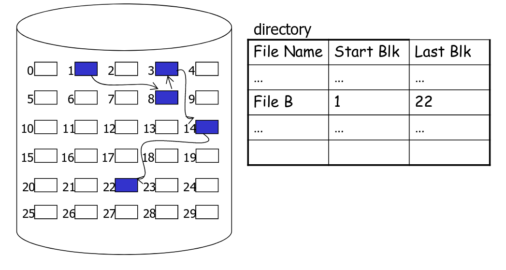 

---
**Indexed structure** (*indirection, hierarchy*)
* An "index block" contains pointers to many other blocks.
* Handles random better, still good for sequential.
* May need muti-level index blocks.

UNIX inodes implement an indexed structure for files. All file metadata is stored in inode. (UNIX dir entries map file names to inode) 
Each inode contains 15 block pointers (i_block):
- First 12 are direct block pointers (disk addresses of the first 12 data blocks).
- Then *single indirect* block pointer.
- Then *double indirect* block pointer.
- Then *triple indirect* block pointer.

### 10.4 Very Simple File System (VSFS)
Overall Organization:
- block size: 4KB
- Number of blocks: 64
- Total size: 256KB
 
    
 

---
*Super block*: when mounting a file system, the OS first reads the superblock, identifies its type and other parameters, then attaches the volume to the file system tree with proper settings.

### 10.5 Other Approaches
*Extent-based* 
An **extent** == a disk pointer plus a length (in number of blocks). So, instead of requiring a pointer to every block of a file, we just need a pointer to every several blocks.
- Disadvantage: Less flexible than the pointer-based approach.
- Advantage: Uses smaller amount of metadata per file, and file allocation is more compact.
- adopted by ext4, NTFS.

---
*Linked-based* 
Instead of pointers to all blocks, the inode just has one pointer to the first data block of the file, then the first block points to the second block, etc.
- Disadvantage: works poorly if we want to access the last block of a big file
- Advantage: uses an in-memory *File Allocation Table*, indexed by address of data block, so faster in finding a block.
- adopted by FAT

### 10.6.1 Inode
- Data structure representing an FS object.
- Attributes, disk block locations.
- No file name, just metadata.

### 10.6.2 Directories
- List of (name, inode) mappings.
- Each directory entry: itself(.), parent dir(..), a file, another directory, link.

### 10.6.3 Hard links
- Multiple file names (and directory entries) mapped to the same inode.
- Reference count - only remove file when it reaches 0

### 10.6.4 Symbolic links
- "Pointer" to a given file
- contains the path as its contents

### 10.6.5 The content of a data block
- *Regular file*: data of the file
- *Directory*: list of directory entries
- *Symbolic Link*: path of the file that it links to 

### 10.6.6 Inodes and Path search
Unix inodes are **not** directories. They describe where on the disk the blocks for a file are placed.
On the contrary, directory entries map file names to inodes.
1. To open "/somefile", use super block to read the inode for root directory.
2. Read data block for root dir, look for an entry with name "somefile".
3. This entry will identify the inode for "somefile".
4. Read the inode for "somefile" into memory.
5. The inode says where first data block is on disk.
6. Read that block into memory to access the data in the file. 

### 10.7.1 File Buffer Cache
Cache file blocks in memory to capture locality.
- Cache is system wide, used and shared by all processes
- Reading from the cache makes a disk perform like memory.
- Significant reuse: spatial and temporal locality. 
Items cached:
- Inodes
- Directory entries
- disk blocks for frequently used files

### 10.7.2 Caching and Buffering
- Static partitioning: at boot time, allocate a fixed-size cache in memory (10 % of total memory).
- Dynamic partitioning: integrate virtual memory pages and file system pages into a unified page cache, so pages of memory can be flexibly allocated for either virtual memory or file system, used by modern systems.

### 10.7.3 Caching writes
Buffering a batch of disk writes is helpful because:
- Combine multiple writes into one write.
- Can improve performance by scheduling the buffered writes (lazy updates), e.g. can schedule buffered writes in such a way that they happen sequentially on disk.
- Can avoid some unnecessary writes.

### 10.7.4 Tradeoff using caching
Caching and buffering improves the speed of file system reads and writes. However, it sacrifies the durability of data, e.g. if crash occurs, buffered writes not written to disk are lost, however, if we sync to disk more frequently will incur a lower speed.

### 10.7.5 Read Ahead
Very helpful for sequentially accessed files, unless blocks for the file are scattered across the disk.
- FS predicts that the process will request next block.
- It goes ahead and requests it from the disk.
- This can happen while the process is computing on previous block i.e. overlapping I/O with execution.
- When the process requests block, it will be in cache.
- Compliments the on-disk cache, which also is doing read ahead.

### 10.8.1 Disk Components

### 10.8.2 Disk Performance
* Seek - moving the disk arm to the correct cylinder
* Rotation - waiting for the sector to rotate under the head
* Transfer - transferring data from surface into disk controller electronics, sending it back to the host.

### 10.8.3 Hardware optimizations
**Track Skew**
 
    
 

---
**Zones**
 
    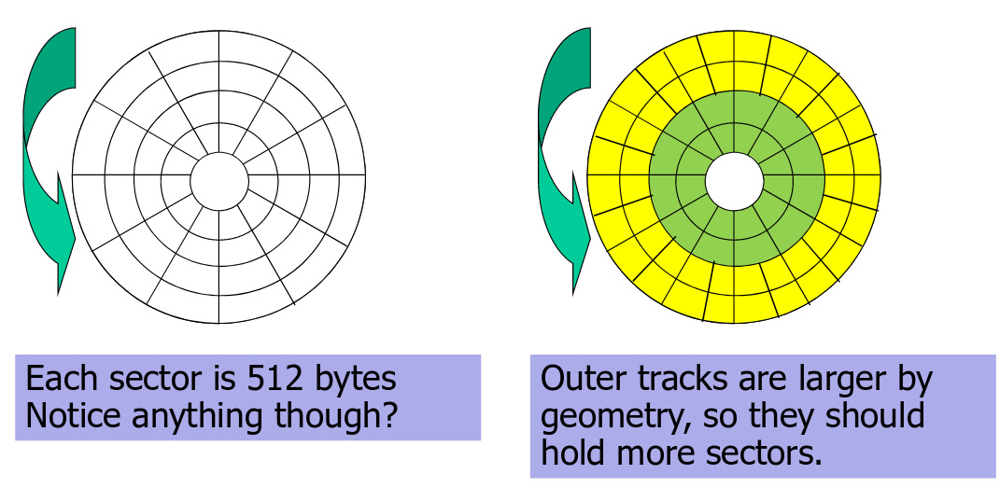
 

---
**Cache** (Track Buffer)
* A small memory chip, part of the hard drive, usually 8-16MB.
* Different from cache that OS has. Unlike the OS cache, it is aware of the disk geometry. When reading a sector, may cache the whole track to speed up future reads on the same track.

### 10.8.4 Enhancing achieved disk performance
- *Closeness*: reduce seek times by putting related things close to each other
- *Amortization*: amortize each positioning delay by grabbing lots of useful data

### 10.9.1 Problems for the original UNIX fs
- Problem #1: On a new FS, blocks are allocated sequentially, close to each other. As the FS gets older, files are being deleted and create random gaps. In aging FS, data blocks end up allocated **far from each other**. Therefore, data blocks for new files end up **scattered across the disk**. Fragmentation of an aging FS requires **more seeking**.
- Problem #2: Inodes allocated far from blocks as all inodes are at the beginning of disk, far from data. Traversing file name paths, manipulating files, directories requires **going back and forth from inodes to data blocks**. Hence, incur a lot of seekings.

### 10.9.2 Cylinder Groups for FFS
FFS addressed placement problems using the notion of a *cylinder group* (aka allocation groups).
* Disk partitioned into groups of cylinders.
* Data blocks in same file allocated in same cylinder group.
* Files in same directory allocated in same cylinder group.
* Inodes for files are allocated in same cylinder group as file data blocks.

 
Allocation in cylinder groups provides *closeness*, hence reduces number of long seeks.

Structure of ext3 file system: 

### 10.10 Disk Scheduling Algorithms
Goal: minimize seeks

---
**FCFS** (do nothing)
- Reasonable when load is low.
- Long waiting time for long request queues.

---
**SSTF** (shortest seek time first)
- Minimize arm movement (seek time), maximize request rate
- Favors middle blocks

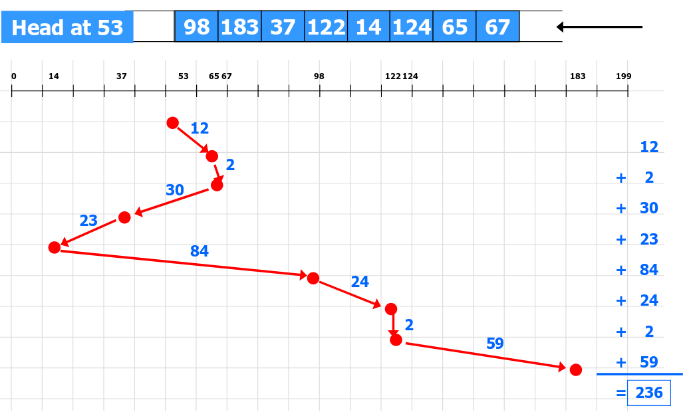

---
**SCAN**
- Service requests in one direction util done, then reverse.

---
**C-SCAN**
- Like SCAN, but only go in one direction.
---

**LOOK / C-LOOK**
- Like SCAN/C-SCAN but only go as far as last request in each direction.

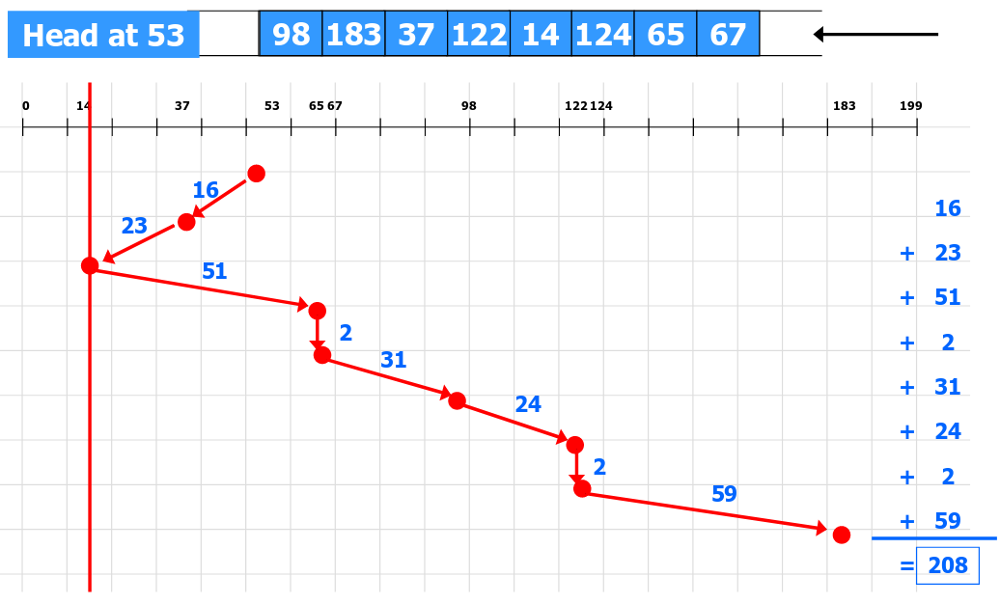

## Week 11 File Systems Integrity

Metadata updates must be synchronous operations. However, a file system operation will affect multiple metadata blocks:
- Write newly allocated inode to disk before its name is entered in a directory
- remove a directory name before the inode is deallocated
- deallocate an inode (mark as free in bitmap) before that file's data blocks are placed into the cylinder group free list

If the OS crashes in between any of these synchronous operations, then the file system is in an inconsistent state. 

---
### 11.1 FSCK
Solution: **fsck** - post-crash recovery process to scan file system structure and restore consistency. 
1. *Superblock*: sanity checks. Use another superblock copy if suspected corruption.
2. *Free blocks*: scan inodes (including all indirect blocks), build bitmap. If inodes / data bitmaps inconsistency is detected, resolve by trusting indoes. Ensure inodes in use are marked in inode bitmaps.
3. *Inode state*: check inode fields for possible corruption. If cannot fix, remove inode and update inode bitmap.
4. *Inode links*: verify links count for each inode. Traverse directory tree, compute expected links count, fix if needed. If inode discovered, but no dire refers to it, move to "lost+found".
5. *Duplicate*: check if two different inodes refer to same block. Clear one if obviously bad, or, give each inode its own copy of block.
6. *Bad blocks*: bad pointers (outside of valid range). Just remove the pointer from the inode or indirect block.
7. *Directory checks*: integrity of directory structure, e.g. make sure that "." and ".." are the first entries, each inode in a directory entry is allocated, no directory is linked more than once.

Log updates to enable roll-back or roll-forward. 
However, fsck cannot fix all problems:
- When data block only contains garbage - cannot know that's the case
- Only cares that FS metadata is consistent.
- Too slow. Even for small inconsistency, must scan the whole disk. Scanning all the integrities could take hours.

---
### 11.2 Journaling
Another solution: **Journaling** (write-ahead logging) 
Basice idea: when doing an update, before overwriting structures, first write down a little note (elsewhere on disk) saying what you plan to do.

If a crash takes place during the actual write, just go back to journal and retry the actual writes. Don't need to scan the entire disk, can also recover data.

if a crash happens before journal write finishes, then it doesn't matter since the actual write has NOT happened at all, so nothing is inconsistent.

Structure of the **Journal entry**: 
- Starts with a "transaction begin" (TxBegin) block, containing a transaction ID.
- Followed by blocks with the content to be written: 
&nbsp;&nbsp; - Physical logging: log exact physical content 
&nbsp;&nbsp; - Logical logging: log more compact logical representation
- Ends with a "transaction end" (TxEnd) block, containing the corresponding TID.

Steps to write a journal entry: 
1. Buffer updates in memory for some time.
2. Write all except TxEnd to journal. (**Journal Write Step**)
3. Then write TxEnd. (**Journal Commit Step**)
4. Finally, journal entry is now safe, write the actual data and metadata to their right locations on FS. (**Checkpoint Step**)
5. Mark transaction as free in journal. (**Free Step**)

Recovery Summary:
- If crash happens during the journal write step (before journal commit step), just skip the pending update.
- If crash happens during the checkpoint step, after reboot, scan the journal and look for committed transactions. Replay these transactions. After replay, FS is guaranteed to be consistent. Called *redo logging*.

---
### 11.3 Metadata Journaling
Although recovery is much faster with journaling (replay only a few transactions instead of checking the whole disk). However, normal operations are slower, as every update must write to the journal first, then do the update, writing time is at least doubled. Journal writing may break sequential writing as jump back-and-forth between writes to journal and writes to main region. 

Metadata journaling is similar, except we only writes FS metadata (no actual data)to the journal: 

Steps to write a journal entry:
1. **Write data** to final location, wait for completion.
2. **Journal metadata write**. Write the begin block and metadata to the log, wait for writes to complete.
3. **Journal commit**. Write the transaction commit block (containing TxE) to the log.
4. **Checkpoint metadata**. Write the contents of the metadata update to their final locations within the file system.
5. Free.

Recovery Summary:  
If a crash happens before journal commit, the journal entry simply won't appear in the final log. If a crash happens between the commit step and the free step, replay the journal entry (i.e. try to checkpoint metadata again). 

---
**Summary: Journaling** 
Journaling ensures file system consistency. Complexity is in the size of the journal, not the size of disk.

Metadata journaling is the most commonly used. It reduces the amount of traffic to the journal, and provides reasonable consistency guarantees at the same time.

---
### 11.4 Log-structured File System
**Motivations**:
* *System memories are growing*: as memory gets bigger, more data can be cached in memory. As more data is cached, disk traffic increasingly consists of writes, since reads are serviced by the cache.
* *Existing file systems perform poorly on many common workloads*: FFS would perform a large number of writes to create a new file of size one block: one for a new inode, one to update the inode bitmap, one to the directory data block, one to the current directory inode... Although FFS places all of these blocks within the same block group, FFS incurs many short seeks and subsequent rotational delays.

---
**The basic idea**: 
Buffer all writes (metadata + data) using an in-memory segment. Once the segment is full (write buffering), write the segment to a log. LFS never overwrites existing data, but rather *always* writes segments to free locations.

---
**Finding Inodes** 
*Difficulties in locating inodes*: inodes all are scattered throughout the disk. Also, since we never overwrite in place, and thus the latest version of an inode keeps moving.

Solution through indirection -- **The Inode Map**:  
LFS solves these problems using an **inode map** which translates inode numbers to (the most recent) on-disk inode locations.

Trick 1: LFS caches the entire inode map in memory. Thus, determining the on-disk location for an inode doesn't require a disk seek.

Trick 2: LFS breaks the inode map into small, logical pieces. When LFS must write an updated inode to the log, LFS also writes the piece of the inode map that is associated with the inode. Periodically, LFS updates a fixed location called the **checkpoint region**:
- The checkpoint region contains pointers to the current versions of the inode pieces (pieces of inode maps).
- During a clean shutdown, LFS flushes the entire in-memory inode map to the checkpoint region.
- After a clean reboot, LFS reads the checkpoint region to create the in-memory indoe map.

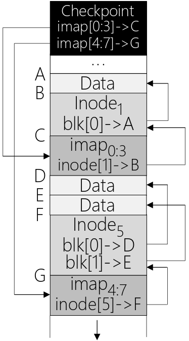
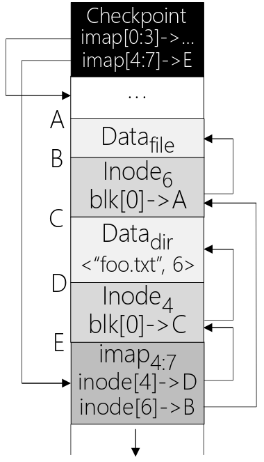

---
**Reading a file from LFS**
1. LFS locates the checkpoint region with fixed on-disk address, reads in the entire inode map, and caches it in memory.
2. When given an inode number of a file, LFS looks up in inode map which translates inode number to disk address, and then reads in the most recent version of the inode.
3. Finally, LFS uses direct pointers or indirect pointers to read the data block like a typical UNIX file system.

In the common cases, LFS performs the same number of IOs as a typical file system when reading a file from disk. The entire inode map is cached and thus the **extra work** LFS does during a read is to look up the inode's address in the inode map.

---
**Crash recovery**

During normal operation, LFS buffers writes in a segment, and then writes the segment to disk (CR points to a head and tail segment, and each segment points to the next segment). LFS also periodically updates the checkpoint region.

If crash happens during the write to the CR. Since LFS keeps two CRs, one at either end of the disk, and writes to them alternately. When updating the CR, it first writes out a header with timestamp, the body of CR, and finally the end with timestamp. If the system crashes during a CR update, LFS can detect this by seeing an inconsistent pair of timestamps, and choose to use the most recent CR that has consistent timestamps. 

If crash happens during the write of a segment. Upon reboot, LFS simply recover by reading in the checkpoint region and rebuild the entire inode map.

In addition, LFS uses a technique known as *roll forward*. Basically, it uses the last valid CR to find the tail segment, and then use that to read through the next segments and see if there are any valid updates within it. 

---
**Garbage collection**

Since LFS repeatedly writes latest version of a file to new locations on disk. Older versions of files (garbage) are scattered throughout the disk. Must periodically find these obsolete versions of file data and clean up in order to provide free blocks for subsequent writes. Cleaning is done on a segment-by-segment basis. Since the segments are large chunks, it avoids the situation of having small "holes" of free space.

---
**Advantage**:
- Very efficient writes.

**Disadvantage**:
- Less efficient reads.
- Garbage collection is tricky.

---
### 11.5 RAID
*Reliability strategies*:
- Data duplicated - mirror images, redundant full copy. If one disk fails, we have the mirror.
- Data spread out accross multiple disks with redundancy, can recover from a disk failure, by reconstructing the data.

---
*Concepts*:
- Redundancy/Mirroring: keep multiple copies of the same block on different drives, just in case a drive fails.
- Parity information: XOR each bit from 2 drives, store checksum on 3rd drive.

---
Some standard RAID levels:
 

---
## Week 12 Deadlock

### 12.1 Non-deadlock bugs

\- **Atomicity violation bugs**: when a code region is intended to be atomic, but the atomicity is not enforced during execution, e.g. two threads modify a counter concurrently, solve by locking around the critical section (where shared resource is modified).

\- **Order violation bugs**: when the desired order between memory accesses is flipped (i.e. when a certain order is assumed, but not specifically enforced).

---
### 12.2 Definition of deadlock
The **mutual** blocking of a set of processes or threads. Each process in the set is blocked, waiting for an event which can only be caused by another process in the set.

Two types of deadlocks:
* Communication deadlocks: communicate with each other
* Resource deadlocks: compete for system resources.

Root causes of **resource deadlocks**:
- Resources are *finite*.
- Processes *wait* if a resource they need is unavailable.
- Resources may be *held* by other waiting processes.

---
### 12.3 Conditions for deadlock
1. **Mutual Exclusion**: only one process may use a resource at a time.
2. **Hold and wait**: a process may hold allocated resources while awaiting assignment of others.
3. **No preemption**: no resource can be forcibly removed from a process holding it.
> These are **necessary** conditions.
4. **Circular wait**: a closed chain of processes exists, such that each process holds at least one resource needed by the next process in the chain.
> Together, these four conditions are **necessary and sufficient** for deadlock.

*Idea*: break one -> deadlock cannot occur

---
### 12.4 Deadlock prevention

### 12.4.1 Preventing Mutual Exclusion
Avoid the need for mutual exclusion. In general, we know this is difficult, because the code we wish to run does indeed have critical sections. The idea is that one could design various data structures without locks at all (*lock-free*). Using powerful hardware instructions, we can build data structures in a manner that does not require explicit locking.
 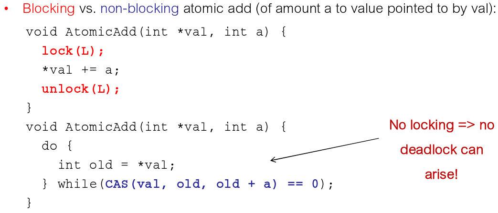

 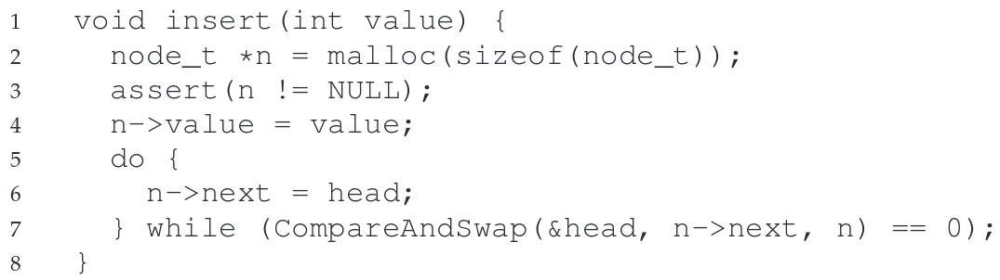

### 12.4.2 Preventing Hold and wait
**Break "hold and wait"** - processes must request all resources at once, and will block utill the entire request can be granted simultaneously, i.e. avoid the hold-and-wait by acquiring all locks at once.

Note that the solution is problematic for a number of reasons.
- When calling a routine, this approach requires us to know exactly which locks must be held and to acquire them ahead of time.
- This technique also is likely to decrease concurrency as all locks must be acquired early on (at once) instead of when they are truly needed.

### 12.4.3 No preemption
Not feasible, or highly complex to safely achieve.

### 12.4.4 Preventing circular wait
**Break "circular wait"** - assigns a linear ordering to resource types and require
that a process holding a resource of one type, R, can only request resources that follow R in the ordering. 

For example, if there are only two locks in the system (L1 and L2), you can prevent deadlock by always acquiring L1 before L2. Such strict ordering ensures that no cyclical wait arises.

---
### 12.5 Deadlock Avoidance
**Avoidance** allows the first three conditions, but ensures that circular wait cannot possibly occur.

\- Two Avoidance Strategies
* Do not start a process if its maximum resource requirements, together with the maximum needs of all processes already running, exceed the total system resources.
* Do not grant an individual resource request, if any future resource allocation "path" leads to deadlock.

\- Restrictions on Avoidance
1. Maximum *resource requirements* for each process *must be known in advance*.
2. Processes *must be independent*. If order of execution is constrained by synchronization requirements, system is not free to choose a safe sequence.
3. There must be a *fixed number of resources to allocate*.

---
### 12.6 Banker's algorithm
Each thread 
- States its maximum resource requirements. 
- Acquires and releases resources incrementally.

Runtime system delays granting some requests to ensure the system never deadlocks.

System can be in one of three states:
* **Safe**: for any possible sequence of resource requests, there is at least one safe sequence that eventually succeeds in granting all pending and future requests.
* **Unsafe**: if all threads request their maximum resources at this point, the system would deadlock (i.e. there is no safe sequence).
* **Deadlocked**

---
*Basic idea*:
1. Can the request be granted? If not, request is impossible at this point -> block the process until we can grant the request.
2. Assume that the request is granted, update state assuming request is granted.
3. Check if new state is safe.

e.g. 
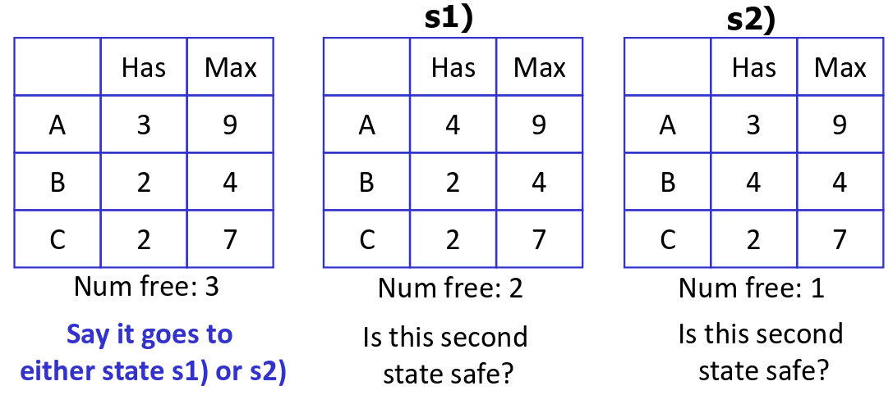

---
### 12.7 Deadlock Detection
Prevention and avoidance are awkward and costly, need to be cautious leads to low utilization. 
Instead, allow deadlocks to occur, but detect when this happens and find a way to break it. (check for circular wait condition periodically) 
When should the system check for deadlocks ?
1. on every allocation request
2. fixed periods
3. when system utilization starts to drop below a threshold

---
**Resource allocation graph** 
Finding circular waits is equivalent to finding a cycle in the *resource allocation graph*.
* Nodes are processes (circle) and resources (square).
* Arcs from a resource to a process represent **allocations**.
* Arcs from a process to a resource represent **ungranted requests**.

> Any algorithm for finding a cycle in a directed graph will do for our goal. (*Note*: with multiple instances of a type of resource, cycles may exist without deadlock)

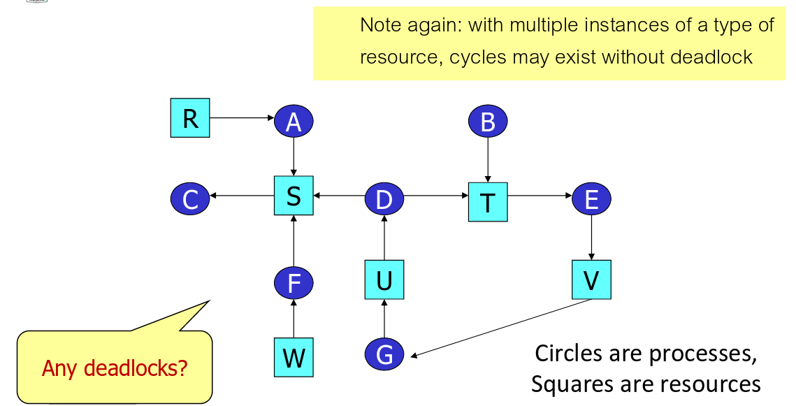

---
### 12.8 Deadlock recovery
Basic idea to break the cycle:
* Drastic - kill all deadlocked processes
* Painful - back up and restart deadlocked processes (hopefully, non-determinism will keep deadlock from repeating)
* Better - selectively kill deadlocked processes util cycle is broken, re-run detection algorithm after each kill.
* Tricky - selectively preempt resources until cycle is broken, processes must be rolled back.

---
### 12.9 Deadlock and Starvation
A set of threads is in a **deadlocked** state when every process in the set is waiting for an event that can be caused only by another process in the set.

A thread is suffering **starvation** if it is waiting indefinitely because other threads are in some way preferred.