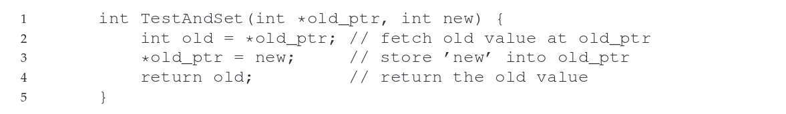
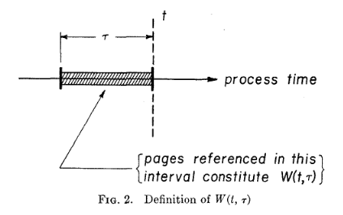
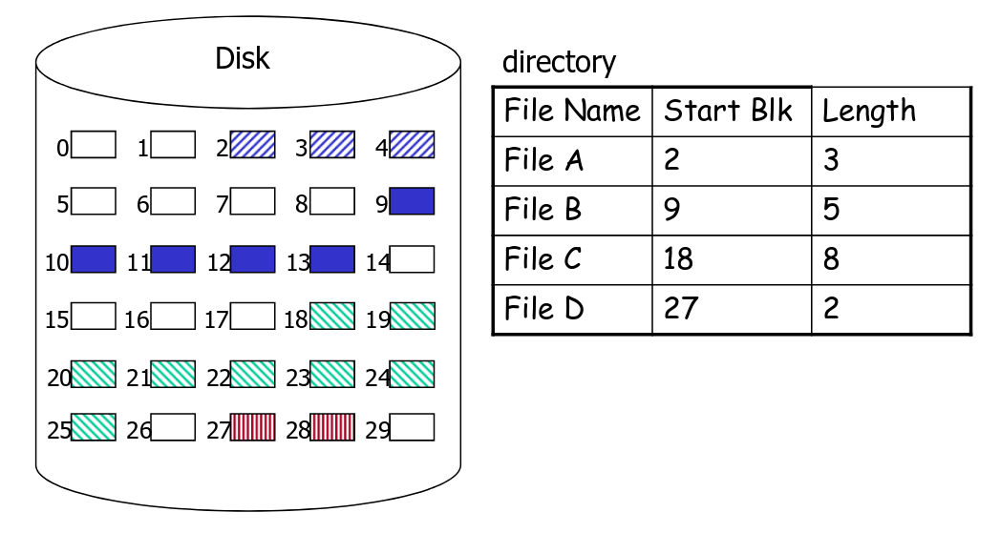

### 1. The Basics</br>
\- What is an operating system ?</br>
- An OS is a **virtual machine**. Extends and simplifies interface to physical machine. Provides a library of functions accessible through an API.
- An OS is a **resource allocator**. Allows the proper use of resources (hardware, software, data) in the operation of the computer system. Provides an environment within which other programs can do useful work.
- An OS is a **control program**. Controls the execution of user programs to prevent errors and improper use of the computer. Especially concerned with the operation and control of I/O devices.

\- Why do we have OS ?
-  **Virtualization**. Present physical resource as a more general, powerful, or easy-to-use form of itself. Present illuion of multiple (or unlimited) resources where only a few really exist, e.g. CPU, memory.
- **Concurrency**. Coordinate multiple activities to ensure correctness.
- **Persistence**. Some data needs to survive crashes and power failures.
---
### 2. Processes & Threads
\- What is a process ? What is a thread ?
- Process is an active entity, a **program in execution** (Programs are static entities with the *potential* for execution). It contains: address space (code, heap) + PC + reg + os resources (open files, network), stored in **PCB**.
- Thread is a single *control flow through a program*. Represented by a PC, reg, stack and small TCB.

\- What is the difference between kernel and user level threads ?
- Kernel level threads: modern OSs **separate the execution of a process into thread abstraction** in order to **make concurrency cheaper** (*much less state to allocate and initialize*). The OS manages threads and processes, all **thread operations are implemented in the kernel**, and **OS schedules all of the threads in the system**. However, suffer from too much overhead: still require system calls (slow down), have to be general to support all languages, runtime, etc.
- User level threads: need to be implemented at user level to make threads **small and fast**, **managed entirely by the run-time system** (user-level library). Thread operations (create, switch, synchronize) are done via **procedure call**. However, user-level threads are **invisible to OS** i.e. not well-integrated with OS. So, OS can make poor decisions: schedule a process with only idle threads, block a process whose thread initiated an I/O, de-schedule a process with a thread holding a lock.

\- How are processes created ? Delete ? Zombies ?
1. Create a new process by creating **new PCB**, **user address space**, and **allocating memory**.
2. **Load the executable** of the program, initilize start state for process, and change state to **ready**.
3. Dispatch the process, and change state from ready to **running** using **context switch** (saving the state of old process, load the save state for the new process). *Note: cs happens when: some process calls yield(), process makes other syscall and is blocked, time interrupt*.</br>


4. On **exit()**, a process voluntarily releases all resources. OS **stops running the process to free everything**, **requires context switch** to another process, **parent may be waiting** or asking for the return value.
5. The process is a **zombie** until its parent cleans it up.

\- What states can a process be in ?</br>


\- What does the address space look like ? PCB ?</br>
PCB includes: **process state** (ready, running, blocked), **PC** (address of the next instruction), CPU **regs** (must be saved at an interrupt); CPU scheduling info: **process priority**; **page table**; resource use info; list of **open files**.</br>


\- How do threads relate to virtual address space ?</br>


---
### 3. System Calls
System call is a function call that invokes the OS. Invoked when an application wants to use a resource that OS manages.

\- What are the protection domains ? Why do we need them ?</br>
Hardware runs in **user mode** or **system mode**. Some instructions are **privileged instructions** - they cn only run in system mode: access I/O device, manipulate memory management, configure mode bits, etc. CPU will check current protection level on each instruction. Without control, a process could simply **run forever** and **take over the machine**, or **access information** that is **should not be alowed** to access.

\- How do interrupt work ? Why do we need them ?</br>
Interrupt can be caused by hardware (I/O device) or software (syscall). When an interrupt occurs, there must be a **reason**. The reason is stored in a register, and that register is used to invoke a **handler**, and CPU will jump to the interrupt handler when an interrupt takes place.

\- What happens when a process makes a system call ?</br>
Kernel assigns each system call a **system call number**. Initialize syscall table and map each system call number to a function. User process sets up syscall number and arguments. HW **switches to kernel mode** and invokes kernel's **interrupt handler**. Kernel **looks up** syscall table using the syscall number. Kernel invokes the corresponding function, then returns.

\- How and when does a context switch happen ?</br>
When the **interrupt handler** is called, HW must make sure to **save enough of the caller's registers** (*push them to kernel stack*) in order to be able to return correctly when the OS issues the return-from-trap instruction (*return-from-trap will pop those values from kernel stack and resume execution of the user-mode program*).

---
### 4. Concurrency
We need **synchronization** since processes interact in a multiprogrammed system , it can help to share resources and to coordinate execution. Also, arbitrary interleaving of thread executions can have unexpected consequences, synchronization can **restrict the possible interleavings of executions**.

\- What is the critical section problem ?</br>
Enforce **single use of a shared resource**. Using a lock to ensure that only one thread can access a critical section (shared resource).

\- What properties does a solution need to have ?</br>
1. **Mutual Exclusion**: if one thread is in CS, then no other is.
2. **Progress**: if no thread is in the CS, and some threads want to enter CS, they should be able to, unrestricted by threads in the "remainder".
3. **Bounded Waiting** (no starvation): if some thread T is waiting on the CS, then there is a limit on the number of times other threads can enter CS before this thread is granted access. (i.e. thread T cannot wait in the "remainder" indefinitely)
4. **Performance**: the overhead of entering and exiting the CS is small with respect to the work being done within it. 

\- What is a race condition ?</br>
When two concurrent threads manipulated a **shared resource** without any synchronization. Outcome depends on the order in which accesses take place.

\- Synchronization primitives</br>
\- S/W - Peterson's Algorithm</br>


\- S/W - Bakery Algorithm</br>
- Upon entering, each thread gets a #.
- Thread with the lowest number is served next.
- No guarantee that 2 threads do not get same #. In case of a tie, thread with the lowest id is served first. Thread ids are unique and totally ordered.

\- H/W - Test-And-Set</br>
</br>


\- H/W - Compare-And-Swap</br>
</br>


\- Lock: a binary semaphore.

\- Semaphores</br>
The initial value of N determines its behavior. Value of the semaphore, when **negative**, equals to the **number of threads waiting**. However, can be hard to reason about synchronization.
``` 
int sem_wait(sem_t *s) {
    decrement the value of semaphore by one,
    wait if value of semaphore s is negative. 
}

int sem_post(sem_t *s) {
    increment the value of semaphore by one,
    if there are one or more threads waiting, wake one.
}
```

\- CV</br>
* **cv_wait()**: release lock, waits, re-acquires mutex before return
* **cv_signal()**: wake one enqueued thread
* **cv_broadcast()**: wake all enqueued thread

**Caution**: if no one is waiting, signal or broadcast has no effect. Not recorded for later use, as with semaphore.

Signaling a thread only wakes them up, it is thus a hint that the state of the world has changed, but there is no guarantee taht when the woken thread runs, the state will still be desired. This interpretation of what a signal means is often referred to as **Mesa** semantics.

**Always** use while loop, also handles the case where spurious wakeups occur i.e. two threads get woken up by a single signal.

\- Monitor

\- Producer-Consumer Problem

\- Reader-Writers Problem

---
### 5. Scheduling

\- Goals in developing a good scheduling algorithm: </br>
**Increase CPU utilization** and **job throughput** by overlapping I/O and computation.
* **Fairness** - each thread receives fair share of CPU
* **Avoid starvation**
* **Balance** - all parts of the system should be busy
* **Throughput** - maximize jobs completed per hour
* **Turnaround time** - minimize time between submission and completion
* **CPU utilization** - keep CPU busy all the time
* **Response time** - minimize time between receiving request and starting to produce output

**Non-preemptive scheduling**: once the CPU has been allocated to a thread, it keeps the CPU until it terminates or blocks</br>
**Preemptive scheduling**: CPU can be taken from a running thread and allocated to another 

\- FCFS</br>
- **Non-preemptive**
- choose the thread at the **head of the ready queue** where queue is maintained in FIFO order.
- Average waiting time with FCFS often quite long, it happens when all other threads wait for the one big thread to release CPU (convoy effect).

\- SJF</br>
- **Preemptive**
- choose the thread with the **shortest expected processing time**.
- **Optimal** with respect to **average wait time**.

\- Round Robin</br>
- **Preemptive**
- Ready queue is circular. Each thread is allowed to **run for time quantum** *q* before being preempted and put back on queue.
- choice of quantum is critical: as *q* approaches infinity, RR becomes FCFS, as *q* approaches 0, RR becomes processor sharing. We want *q* to be **large** with respect to **context switch time**.

\- Multi-Level Feedback Queue</br>


---
### 6. Memory Management
\- What are the goals of virtual memory ?</br>
* Efficiency: only have a limited amount of physical memory, must use efficiently
* Transparency: must provide the illusion of "infinite" memory to each process, decouple the data layout from where the data is actually stored in physical memory
* Protection and sharing: physical memory is accessed by multiple processes, and must ensure data privacy

---
### 6.1 Virtualizing Memory
\- What is the difference between a physical and virtual address ?</br>
OS virtualizes the memory using *address space*. When a running program is loaded into the memory, it will have the illusion that it has its own private physical memory. OS will translate this virtual address to the real physical address.</br>

\- What is the difference between fixed and variable partitioning ?</br>
* **fixed partitioning**, each process gets a fixed partition to use. Likely to cause **internal fragmentation**.
* **dynamic partitioning**, partitions will vary in length (exactly the size of the process) and numbers over time. We need **base** register to locate the physical address since *pa = base + va*, and **bound** register to ensure that we don't access outside a process' address space. (MMU only has one base and bound register). Likely to cause **external fragmentation**. OS may move processes around to create large chunks of free space. This is called compaction and requires processes to be **relocatable**.

\- What is internal fragmentation ? What is external fragmentation ?</br>
If process is smaller than the partition allocated, an **internal fragmentation** is incurred. </br> If a process exited, a "hole" will be created, and some holes may be too small to be re-used, this will cause **External fragmentation**.

\- What is a protection fault ?</br>
If we try TO refer to an illegal address, the hardware will detect that the address is out of **bounds**, traps into OS, likely leading to the termination of the offending process and the *segmentation fault*.

---
### 6.2 Paging
\- How is paging different ?</br>
Paging works by decoupling address space completely from actual physical data location and splitting both virtual and physical memory in same-size **pages**.
</br>

</br>
* Each process gets the illusion of its personal address space (<em>AS</em>) from
**0 to 2^64-1**.
* Each virtual page can be mapped to any physical page.
* Data is either in **memory** or on **disk** (must bring data in memory if needed).

\- What are the advantages/disadvantages of paging ?</br>
* It does not lead to external fragmentation, as paging divides memory into fixed-sized units.
* **Flexible**, enabling the sparse use of virtual address spaces.
* However, implementing paging support without care will lead to a **slower machine** (with many extra memory accesses to access the page table) as well as **memory waste** (with memory filled with page tables instead of useful application data).

\- What are page tables ?</br>
* A linear array of *page table* entries, 1 entry per virtual page.
* Stored in **OS memory, attached to PCB**.
* Virtual page number (VPN) serves as array index.
* Allocate enough physical memory (ppages) for entire page table.

\- What are page table entries ?</br>
</br>
* **Modify bit**(M) says whether or not page has been written. Set when a write to a page occurs.
* **Reference bit**(R) says whether page has been accessed. Set when a read or write to the page occurs.
* **Valid bit**(V) says whether PTE can be used. Checked on each use of virtual address.
* **Protection bit**(Prot) specifies what operations are allowed on page (read/write/execute)
* **Page frame number**(PFN) determines physcial page.</br>Not all bits are provided by all architectures.

\- VPN, PFN, offset</br>
VPN: index into the page table in order to attain PFN</br>
PFN: index of the page frames into the physical memory</br>
Offset: stored in VA served as the index into the page frames</br>

---
### 6.3 TLB
\- What problem does the TLB solve ?</br>
TLB is small, fully-associative hardware cache of recently used translations. It **translates** virtual page numbers (VPNs) into PTEs (not physical addresses) and can be done in a single machine cycle, hence **reduce the time for translation**.

\- How do TLBs work ?</br>
TLBs are implemented in hardware:
* Fully associative cache (all entries looked up in parallel).
* Cache tags are virtual page numbers.
* Cache values are PTEs (entries from page tables).
* With PFN + offset, can directly calculate physical address.</br>
</br>

\- Why are TLBs effective ?</br>
Since TLB exploit **locality**. Processes only use a handful of pages at a time, and we only need those pages to be "mapped". Hit rates: >99% of translations are hits.

\- What is the difference between a hardware and software managed TLB ?</br>
* Hardware-loaded (MMU): know where page tables are in main memory (PTBR). OS maintains table in memory, HW accesses them directly. Tables have to be in HW-defined format.
* Software-loaded: TLB faults to the OS, OS finds appropriate PTE, loads it in TLB. CPU has instructions for manipulating TLB. Tables can be in any format convenient for OS (flexible).

---
### 6.4 Page Faults

\- What is a page fault ? How is it used to implement demand paged vm ?</br>
When a process accesses the page, the invalid PTE (not in physical memory) will cause a **page fault**. OS page fault handler will run and use the invalid PTE to locate page in swap file. Reads page into a physical frame and updates PTE to point to it.

\- What is the complete sequence of steps, from a TLB miss to paging in from disk, for translating a virtual address to a physical address ?</br>
The movement of pages between memory and disk is done by **OS**. The translation between virtual address and physical address is done by **hardware** (MMU).

---
### 6.5 Page Replacement

\- What is the purpose of the page replacement algorithm ?</br>
To **reduce the fault rate** by selecting the best victim page to remove. (The best page is the one never used again.)

\- What application behavior does page replacement try to exploit ?</br>
**Spacial locality** (if a page is accessed, it is likely the pages around it will also be accessed) and **temporal locality** (pages that have been accessed in the near past are likely to be accessed again in the near future).

\- When is the page replacement algorithm used ?</br>
When we need to load a new page from disk into page frames of memory. There may be no free frames available for use. When this happens, the OS must replace a page for the new page.

\- Belady's algorithm (OPT)</br>
It has the lowest fault rate for any page reference string. It works by replacing the page that will not be used for the longest period of time.

\- First-In-First-Out (FIFO)</br>
* Maintain a list of pages in order in which they were paged in. On replacement, simply evict the one brought in longest time ago.
* The fault rate **increases** when the algorithm is given more memory.

\- Least Recently Used (LRU)</br>
* Uses reference information to make a more informed replacement decision. Can make a guess of the future based opon past experience.
* On replacement, evict the page that has not been used for the longest time in the past.
* Options for implementing LRU:
&nbsp;&nbsp; \- *Time stamp* every reference and evict the page with oldest time stamp. The problem is we need to make PTE large enough to hold meaningful time stamp and need to examing every page on eviction to find one with oldest time stamp.</br>
&nbsp;&nbsp; \- Keep pages in a *stack*. On reference, move the page to the top of the stack. On eviction, replace page at bottom. The problem is we need costly software operation to manipulate stack on *EVERY* memory reference.
* We can implement *Approximating LRU* to avoid too much cost. It uses the PTE *reference bit*. Keep a counter for each page. At regular intervals, for every page: shift R bits into high bit of counter register, shift other bits to the right and pages with "larger" counters were used more recently.

\- Clock</br>
Replace page that is "*old enough*".
* Arrange all of physical page frames in a big circle (clock).
* A clock hand is used to select a good LRU candidate.</br>
&nbsp;&nbsp; \- Sweep through the pages in circular order like a clock.</br>
&nbsp;&nbsp; \- If the ref bit is off, it hasn't been used recently.</br>
&nbsp;&nbsp; \- If the ref bit is on, turn it off and go to next page.
* Arm moves quickly when pages are needed and low overhead when plenty of memory.
* If memory is large, "accuracy" of information degrades.

\- Belady's anomaly</br>
It is the phenomenon in which **increasing** the **number of page frames** results in an **increase** in the number of page **faults**. In optimal, as the page frames increase the page fault decreases.

\- Working set model</br>
A *working set* of a process is used to model the dynamic locality of its memory usage.
* W(t, r) = {pages P s.t. P was referenced ini the time interval (t, t-r)}
* w(t, r) = number of pages in W(t, r)</br>



<p>
The working set size <strong>changes with program locality</strong>. During periods of poor locality, more pages are referenced, and within this period of time, the working set size is larger. So, intuitively, want the working set to be the set of pages a process needs in <em>memory</em> to prevent heavy faulting.</br>
e.g. when people ask, "How much memory does Firefox need?", they are in effect asking for the size of Firefox's working set.</p>

\- Page fault frequency</br>
Monitor the fault rate for each process. If the fault rate is above a high threshold, give it more memory. If the rate is below a low threshold, take away memory.

---
### 6.6 Advanced Memory Management
\- What is thrashing ? Possible solutions ?</br>
Thrashing takes place when more time is spent by the OS in paging data back and forth from disk than executing user programs caused by memory demands of the set of running processes simply exceeding the available physcial memory.
* `Admission control`: Given a set of processes, a system could decide not to run a subset of processes, with the hope that the reduced set of processes' *working sets* (the pages that they are using actively) fit in memory and thus can make progress. (states that it is sometimes better to do less work well than to do everything at once poorly)
* `Out-of-memory killer`: this daemon chooses a memory-intensive process and kills it, thus reducing memory in a none-too-subtle manner. While successful at reducing memory pressure, this approach can have problems, if, for example, it kills the X server and thus renders any applications requiring the display unusable.

---
\- Multiprogramming correlation with CPU utilization ?</br>
<p align="center">
</p>

As the illustration shows, *CPU utilization* of a system can be improved by using multiprogramming. Let P be the fraction of time that a process spends away from the CPU. If there is one process in memory, the CPU utilization is 1-P. If there are N processes in memory, the probability of N processes waiting for an I/O is P\*P...*p (N times). The CPU utilization is (1-P^N) where N is the degree of multiprogramming. As N increases, the CPU utilization increases.</br>
However, once the system passes the point of optimal CPU utilization, as less memory is available to each program will cause higher page fault likelihood i.e. it thrashes.

---
\- What is shared memory ?</br>
Since private virtual address spaces protect applications from each other, but this makes it difficult to share data. Parents and children in a forking web server or proxy will want to share an in-memory cache without copying. So, we can use shared memory to allow processes to share data using direct memory references.
</br></br>
Implement sharing using page tables:
* Have PTEs in both tables map to the same physical frame.
* Each PTE can have different protection values.
* Must update both PTEs when page becomes invalid.
In the illustration above, we map shareed memory at same virtual addresses. We can also map at different virtual addresses in each process' address space. It will be more flexible since we can avoid address space conflicts, but pointers inside the shared memory segment are invalid.

---
\- What is copy on write ?</br>
Copy on write (*CoW*) is used to defer large copies as long as possible, hoping to avoid them altogether. 
* Instead of copying pages, create *shared mappings* of parent pages in child virtual address space.
* Shared pages are protected as read-only in child. Reads happen as usual. Writes generate a protection fault, trap to OS, copy page, change page mapping in client page table, restart write instruction.

---
### 7. Disk and File Systems
\- What is a file system ? Why are file systems useful ?</br>
File system is the storage for long term information. It is required to store very large amounts of information which must survive the termination of process using it, and multiple processes must be able to access info concurrently.</br>
Two views of file systems:
- User view \- convenient logical origanization of information.
- OS view \- managing physical storage media, enforcing access restrictions.

---
\- Disk Layout Strategies</br>
**Contiguous Allocation**</br>
* Like memory, fast, simplifies directory access.
* Inflexibal, causes fragmentation, needs compaction.
</br>

**Linked Allocation**
* Each block points to the next, directory points to the first.
* Good for sequential access, bad for all others.
</br>

**Indexed structure** (*indirection, hierarchy*)
* An "index block" contains pointers to many other blocks.
* Handles random better, still good for sequential.
* May need muti-level index blocks.

---
\- How are inodes different from directories ? How are inodes and directories used to do path resolution, find files ?</br>
Unix inodes are **not** directories. They describe where on the disk the blocks for a file are placed.
On the contrary, directory entries map file names to inodes.
1. To open "/somefile", use super block to read the inode for root directory.
2. Read data block for root dir, look for an entry with name "somefile".
3. This entry will identify the inode for "somefile".
4. Read the inode for "somefile" into memory.
5. The inode says where first data block is on disk.
6. Read that block into memory to access the data in the file. 

---
\- Other approaches for storing data blocks in inode</br>
*Extent-based*</br>
An **extent** == a disk pointer plus a length (in number of blocks). So, instead of requiring a pointer to every block of a file, we just need a pointer to every several blocks.
- Disadvantage: Less flexible than the pointer-based approach.
- Advantage: Uses smaller amount of metadata per file, and file allocation is more compact.
- adopted by ext4, NTFS.

*Linked-based*</br>
Instead of pointers to all blocks, the inode just has one pointer to the first data block of the file, then the first block points to the second block, etc.
- Disadvantage: works poorly if we want to access the last block of a big file
- Advantage: uses an in-memory *File Allocation Table*, indexed by address of data block, so faster in finding a block.
- adopted by FAT

---
\- What's the file buffer cache, and why do operating systems use one ?</br>
Cache file blocks in memory to capture locality.
- Cache is system wide, used and shared by all processes
- Reading from the cache makes a disk perform like memory.
- Significant reuse: spatial and temporal locality.</br>
Items cached:
- Inodes
- Directory entries
- disk blocks for frequently used files

\- Why is **buffering writes** useful ?</br>
Buffering a batch of disk writes is helpful because:
- Combine multiple writes into one write.
- Can improve performance by scheduling the buffered writes (lazy updates), e.g. can schedule buffered writes in such a way that they happen sequentially on disk.
- Can avoid some unnecessary writes.

\- What is a **major tradeoff** when it comes to **caching and buffering** ?</br>
Caching and buffering improves the speed of file system reads and writes. However, it sacrifies the durability of data, e.g. if crash occurs, buffered writes not written to disk are lost, however, if we sync to disk more frequently will incur a lower speed.

\- What is **read ahead** and why is it important ?</br>
Very helpful for sequentially accessed files, unless blocks for the file are scattered across the disk.
- FS predicts that the process will request next block.
- It goes ahead and requests it from the disk.
- This can happen while the process is computing on previous block i.e. overlapping I/O with execution.
- When the process requests block, it will be in cache.
- Compliments the on-disk cache, which also is doing read ahead.

---
---
\- What are some hardware optimizations ?</br>
**Track Skew**
</br>
    
</br>

**Zones**
</br>
    
</br>

**Cache** (Track Buffer)
* A small memory chip, part of the hard drive, usually 8-16MB.
* Different from cache that OS has. Unlike the OS cache, it is aware of the disk geometry. When reading a sector, may cache the whole track to speed up future reads on the same track.

---
\- What steps determine disk request performance ?</br>
* Seek - moving the disk arm to the correct cylinder
* Rotation - waiting for the sector to rotate under the head
* Transfer - transferring data from surface into disk controller electronics, sending it back to the host.

\- Why try to allocate related data close together ?</br>
- *Closeness*: reduce seek times by putting related things close to each other
- *Amortization*: amortize each positioning delay by grabbing lots of useful data

\- What is FFS, and how is it an improvement over the original Unix file system ?</br>
Problems for the original UNIX fs:
- Problem #1: On a new FS, blocks are allocated sequentially, close to each other. As the FS gets older, files are being deleted and create random gaps. In aging FS, data blocks end up allocated **far from each other**. Therefore, data blocks for new files end up **scattered across the disk**. Fragmentation of an aging FS requires **more seeking**.
- Problem #2: Inodes allocated far from blocks as all inodes are at the beginning of disk, far from data. Traversing file name paths, manipulating files, directories requires **going back and forth from inodes to data blocks**. Hence, incur a lot of seekings.

FFS addressed placement problems using the notion of a *cylinder group* (aka allocation groups).
* Disk partitioned into groups of cylinders.
* Data blocks in same file allocated in same cylinder group.
* Files in same directory allocated in same cylinder group.
* Inodes for files are allocated in same cylinder group as file data blocks.

</br>
Allocation in cylinder groups provides *closeness*, hence reduces number of long seeks.

Structure of ext3 file system:</br>

---
\- How can disk scheduling improve performance ?</br>
Disk scheduling improves performance by **reducing seek time**.

**FCFS** (do nothing)
- Reasonable when load is low.
- Long waiting time for long request queues.


---
**SSTF** (shortest seek time first)
- Minimize arm movement (seek time), maximize request rate
- Favors middle blocks


---
**SCAN**
- Service requests in one direction util done, then reverse.


---
**C-SCAN**
- Like SCAN, but only go in one direction.
---

**LOOK / C-LOOK**
- Like SCAN/C-SCAN but only go as far as last request in each direction.


---
\- **fsck** - post-crash recovery process to scan file system structure and restore consistency. 
1. *Superblock*: sanity checks. Use another superblock copy if suspected corruption.
2. *Free blocks*: scan inodes (including all indirect blocks), build bitmap. If inodes / data bitmaps inconsistency is detected, resolve by trusting indoes. Ensure inodes in use are marked in inode bitmaps.
3. *Inode state*: check inode fields for possible corruption. If cannot fix, remove inode and update inode bitmap.
4. *Inode links*: verify links count for each inode. Traverse directory tree, compute expected links count, fix if needed. If inode discovered, but no dire refers to it, move to "lost+found".
5. *Duplicate*: check if two different inodes refer to same block. Clear one if obviously bad, or, give each inode its own copy of block.
6. *Bad blocks*: bad pointers (outside of valid range). Just remove the pointer from the inode or indirect block.
7. *Directory checks*: integrity of directory structure, e.g. make sure that "." and ".." are the first entries, each inode in a directory entry is allocated, no directory is linked more than once.

Log updates to enable roll-back or roll-forward.</br>
However, fsck cannot fix all problems:
- When data block only contains garbage - cannot know that's the case
- Only cares that FS metadata is consistent.
- Too slow. Even for small inconsistency, must scan the whole disk. Scanning all the integrities could take hours.

---
\- **Journaling** (write-ahead logging)</br>
Basice idea: when doing an update, before overwriting structures, first write down a little note (elsewhere on disk) saying what you plan to do.

If a crash takes place during the actual write, just go back to journal and retry the actual writes. Don't need to scan the entire disk, can also recover data.

if a crash happens before journal write finishes, then it doesn't matter since the actual write has NOT happened at all, so nothing is inconsistent.

Structure of the **Journal entry**:</br>
- Starts with a "transaction begin" (TxBegin) block, containing a transaction ID.
- Followed by blocks with the content to be written:</br>
&nbsp;&nbsp; - Physical logging: log exact physical content</br>
&nbsp;&nbsp; - Logical logging: log more compact logical representation
- Ends with a "transaction end" (TxEnd) block, containing the corresponding TID.


Steps to write a journal entry:</br>
1. Buffer updates in memory for some time.
2. Write all except TxEnd to journal. (**Journal Write Step**)
3. Then write TxEnd. (**Journal Commit Step**)
4. Finally, journal entry is now safe, write the actual data and metadata to their right locations on FS. (**Checkpoint Step**)
5. Mark transaction as free in journal. (**Free Step**)

Recovery Summary:
- If crash happens during the journal write step (before journal commit step), just skip the pending update.
- If crash happens during the checkpoint step, after reboot, scan the journal and look for committed transactions. Replay these transactions. After replay, FS is guaranteed to be consistent. Called *redo logging*.

---
\- **Metadata Journaling**</br>
Although recovery is much faster with journaling (replay only a few transactions instead of checking the whole disk). However, normal operations are slower, as every update must write to the journal first, then do the update, writing time is at least doubled. Journal writing may break sequential writing as jump back-and-forth between writes to journal and writes to main region. 

Metadata journaling is similar, except we only writes FS metadata (no actual data)to the journal:</br>


Steps to write a journal entry:
1. **Write data** to final location, wait for completion.
2. **Journal metadata write**. Write the begin block and metadata to the log, wait for writes to complete.
3. **Journal commit**. Write the transaction commit block (containing TxE) to the log.
4. **Checkpoint metadata**. Write the contents of the metadata update to their final locations within the file system.
5. Free.

Recovery Summary: </br>
If a crash happens before journal commit, the journal entry simply won't appear in the final log. If a crash happens between the commit step and the free step, replay the journal entry (i.e. try to checkpoint metadata again). 

---
**Summary: Journaling**</br>
Journaling ensures file system consistency. Complexity is in the size of the journal, not the size of disk.

Metadata journaling is the most commonly used. It reduces the amount of traffic to the journal, and provides reasonable consistency guarantees at the same time.

---
\- What is LFS ? What was the key idea in its design ? Advantages and drawbacks ?</br>
**The basic idea**:</br>
Buffer all writes (metadata + data) using an in-memory segment. Once the segment is full (write buffering), write the segment to a log. LFS never overwrites existing data, but rather *always* writes segments to free locations.

**Advantage**:
- Very efficient writes.

**Disadvantage**:
- Less efficient reads since we need to look up the inode's address in the inode map.
- Garbage collection is tricky.

</br>
</br>

\- Can we handle complete disk crashes ? What's the idea behind RAID ? Levels of RAID ?
- Data duplicated - mirror images, redundant full copy. If one disk fails, we have the mirror.
- Data spread out accross multiple disks with redundancy, can recover from a disk failure, by reconstructing the data.
</br>

### 8. Deadlocks
\- What is the definition of a deadlock ?</br>
The **mutual** blocking of a set of processes or threads. Each process in the set is blocked, waiting for an event which can only be caused by another process in the set.

\- What are the conditions for deadlock ?</br>
1. **Mutual Exclusion**: only one process may use a resource at a time.
2. **Hold and wait**: a process may hold allocated resources while awaiting assignment of others.
3. **No preemption**: no resource can be forcibly removed from a process holding it.
> These are **necessary** conditions.
4. **Circular wait**: a closed chain of processes exists, such that each process holds at least one resource needed by the next process in the chain.
> Together, these four conditions are **necessary and sufficient** for deadlock.

*Idea*: break one -> deadlock cannot occur

---
\- Deadlock Prevention</br>
**Preventing Mutual Exclusion**</br>
Avoid the need for mutual exclusion. In general, we know this is difficult, because the code we wish to run does indeed have critical sections. The idea is that one could design various data structures without locks at all (*lock-free*). Using powerful hardware instructions, we can build data structures in a manner that does not require explicit locking.
</br>

</br>

**Preventing Hold and wait**</br>
**Break "hold and wait"** - processes must request all resources at once, and will block utill the entire request can be granted simultaneously, i.e. avoid the hold-and-wait by acquiring all locks at once.

Note that the solution is problematic for a number of reasons.
- When calling a routine, this approach requires us to know exactly which locks must be held and to acquire them ahead of time.
- This technique also is likely to decrease concurrency as all locks must be acquired early on (at once) instead of when they are truly needed.

**No preemption**</br>
Not feasible, or highly complex to safely achieve.

**Preventing circular wait**</br>
**Break "circular wait"** - assigns a linear ordering to resource types and require
that a process holding a resource of one type, R, can only request resources that follow R in the ordering. 

For example, if there are only two locks in the system (L1 and L2), you can prevent deadlock by always acquiring L1 before L2. Such strict ordering ensures that no cyclical wait arises.

---
\- Deadlock Avoidance</br>
**Avoidance** allows the first three conditions, but ensures that circular wait cannot possibly occur.

\- Two Avoidance Strategies
* Do not start a process if its maximum resource requirements, together with the maximum needs of all processes already running, exceed the total system resources.
* Do not grant an individual resource request, if any future resource allocation "path" leads to deadlock.

\- Restrictions on Avoidance
1. Maximum *resource requirements* for each process *must be known in advance*.
2. Processes *must be independent*. If order of execution is constrained by synchronization requirements, system is not free to choose a safe sequence.
3. There must be a *fixed number of resources to allocate*.

---
\- Deadlock Detection</br>
Prevention and avoidance are awkward and costly, need to be cautious leads to low utilization.</br>
Instead, allow deadlocks to occur, but detect when this happens and find a way to break it. (check for circular wait condition periodically)</br>
When should the system check for deadlocks ?
1. on every allocation request
2. fixed periods
3. when system utilization starts to drop below a threshold

**Resource allocation graph**</br>
Finding circular waits is equivalent to finding a cycle in the *resource allocation graph*.
* Nodes are processes (circle) and resources (square).
* Arcs from a resource to a process represent **allocations**.
* Arcs from a process to a resource represent **ungranted requests**.

> Any algorithm for finding a cycle in a directed graph will do for our goal. (*Note*: with multiple instances of a type of resource, cycles may exist without deadlock)


--- 
\- Deadlock recovery</br>
Basic idea to break the cycle:
* Drastic - kill all deadlocked processes
* Painful - back up and restart deadlocked processes (hopefully, non-determinism will keep deadlock from repeating)
* Better - selectively kill deadlocked processes util cycle is broken, re-run detection algorithm after each kill.
* Tricky - selectively preempt resources until cycle is broken, processes must be rolled back.

---
\- Banker's Algorithm</br>
Each thread 
- States its maximum resource requirements. 
- Acquires and releases resources incrementally.

Runtime system delays granting some requests to ensure the system never deadlocks.

System can be in one of three states:
* **Safe**: for any possible sequence of resource requests, there is at least one safe sequence that eventually succeeds in granting all pending and future requests.
* **Unsafe**: if all threads request their maximum resources at this point, the system would deadlock (i.e. there is no safe sequence).
* **Deadlocked**

---
*Basic idea*:
1. Can the request be granted? If not, request is impossible at this point -> block the process until we can grant the request.
2. Assume that the request is granted, update state assuming request is granted.
3. Check if new state is safe.

e.g.</br>
